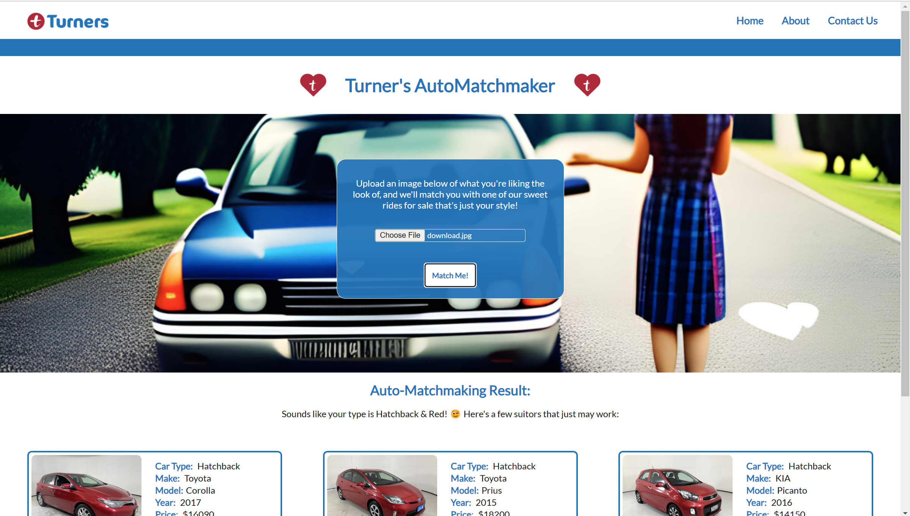

<a name="readme-top"></a>

<!-- PROJECT SHIELDS -->

[![Contributors][contributors-shield]][contributors-url]
Luis Rodríguez - [![GitHub - Luis Rodríguez][Github.logo]][luis-github-url]
Kelsie Smith - [![GitHub - Kelsie Smith][Github.logo]][kelsie-github-url]

<!-- PROJECT LOGO -->
<br />
<div align="center">
  <a href="https://github.com/WeisshorNz/L5-Mission2">
  
  </a>

<h3 align="center">Turner's AutoMatchmaker</h3>

  <p align="center">
   This application can recognise motor vehicles from a car photo uploaded and produce a range of similar car types and colours as potential cars to purchase from Turner's current cars for sale. This has been created using using a cloud-based AI service on Microsoft Azure. 
    <br />
    <a href="https://github.com/WeisshorNz/L5-Mission2"><strong>Explore the docs »</strong></a>

  </p>
</div>

<!-- TABLE OF CONTENTS -->
<details>
  <summary>Table of Contents</summary>
  <ol>
    <li>
      <a href="#about-the-project">About The Project</a>
      <ul>
        <li><a href="#built-with">Built With</a></li>
      </ul>
    </li>
    <li>
      <a href="#getting-started">Getting Started</a>
      <ul>
        <li><a href="#prerequisites">Prerequisites</a></li>
        <li><a href="#installation">Installation</a></li>
      </ul>
    </li>
    <li><a href="#usage">Usage</a></li>
    <li><a href="#contact">Contact</a></li>
    <li><a href="#acknowledgments">Acknowledgments</a></li>
  </ol>
</details>

<!-- ABOUT THE PROJECT -->

## About The Project



<p align="right">(<a href="#readme-top">back to top</a>)</p>

### Built With

- [![React][React.js]][React-url]
- [![Node.js][Node.js.logo]][Nodejs-url]

<p align="right">(<a href="#readme-top">back to top</a>)</p>

<!-- GETTING STARTED -->

## Getting Started

### Prerequisites

This is an example of how to list things you need to use the software.

Backend:

├── axios@1.4.0
├── cors@2.8.5
├── dotenv@16.3.1
├── express@4.18.2
└── nodemon@3.0.1

Frontend:

├── axios@1.4.0
├── react-dom@18.2.0
├── react-icons@4.10.1
├── react-scripts@5.0.1
├── react@18.2.0
└── web-vitals@2.1.4

### Installation

1. Require the API Key with permission from luisR@missionreadyhq.com
2. Clone the repo
   ```sh
   git clone https://github.com/WeisshorNz/L5-Mission2.git
   ```
3. Install NPM packages (as per above list)
   ```sh
   npm install
   ```
4. Enter your API Key, Endpoint, Headers and Port in `.env`
5. Open backend folder in terminal and run start script
   ```sh
   npm run start
   ```
6. Open frontend folder in terminal and run start script
   ```sh
   npm run start
   ```

<p align="right">(<a href="#readme-top">back to top</a>)</p>

<!-- USAGE EXAMPLES -->

## Usage

Use this space to show useful examples of how a project can be used. Additional screenshots, code examples and demos work well in this space. You may also link to more resources.

_For more examples, please refer to the [Documentation](https://example.com)_

<p align="right">(<a href="#readme-top">back to top</a>)</p>

<!-- CONTACT -->

## Contact

Luis Rodríguez - luisR@missionreadyhq.com
<br></br><br></br>
Kelsie Smith - kelsieS@missionreadyhq.com

- [![LinkedIn - Kelsie Smith][linkedin-shield]][kelsie-linkedin-url]
  <br></br>
  <br></br>
  Project Link: [https://github.com/WeisshorNz/L5-Mission2](https://github.com/WeisshorNz/L5-Mission2)

<p align="right">(<a href="#readme-top">back to top</a>)</p>

<!-- ACKNOWLEDGMENTS -->

## Acknowledgments

- [Best README Template](https://github.com/othneildrew/Best-README-Template/tree/master)
- [Stanford Cars Dataset](https://www.kaggle.com/datasets/jessicali9530/stanford-cars-dataset?resource=download)

<p align="right">(<a href="#readme-top">back to top</a>)</p>

<!-- MARKDOWN LINKS & IMAGES -->

[contributors-shield]: https://img.shields.io/github/contributors/WeisshorNz/L5-Mission2.svg?style=for-the-badge
[contributors-url]: https://github.com/WeisshorNz/L5-Mission2/graphs/contributors
[linkedin-shield]: https://img.shields.io/badge/-LinkedIn-black.svg?style=for-the-badge&logo=linkedin&colorB=555
[Github.logo]: https://img.shields.io/badge/GitHub-100000?style=for-the-badge&logo=github&logoColor=white
[luis-github-url]: https://github.com/WeisshorNz
[kelsie-github-url]: https://github.com/KelsieSmitty
[kelsie-linkedin-url]: https://www.linkedin.com/in/kelsieSmitty/
[product-screenshot]: images/screenshot.png
[React.js]: https://img.shields.io/badge/React-20232A?style=for-the-badge&logo=react&logoColor=61DAFB
[React-url]: https://reactjs.org/
[Nodejs-url]: https://nodejs.org/en
[Node.js.logo]: https://img.shields.io/badge/Node.js-43853D?style=for-the-badge&logo=node.js&logoColor=white
